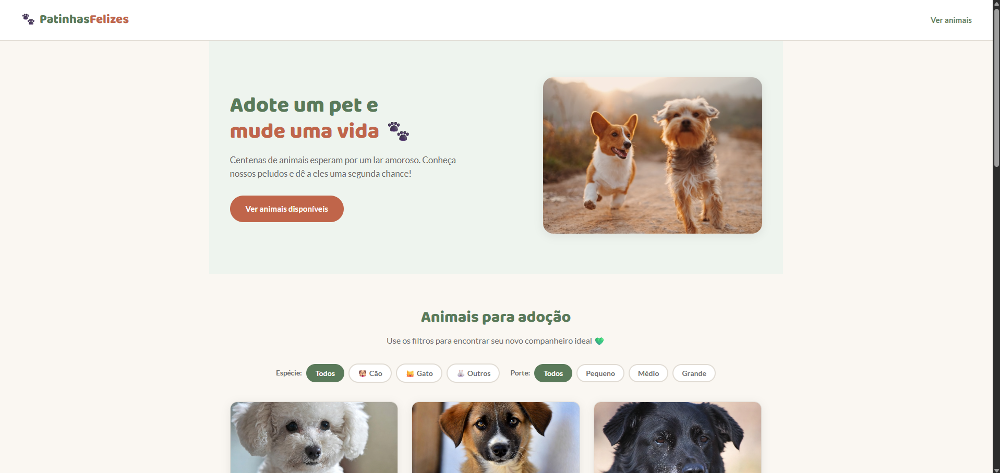

# 🐾 Patinhas Felizes — Landing Page de Adoção

Uma landing page interativa para adoção de pets, desenvolvida com foco em experiência do usuário, organização de código e manipulação dinâmica de dados no frontend.

---

## 📸 Sobre o Projeto

O **Patinhas Felizes** é uma aplicação web que simula um sistema de adoção de animais, permitindo visualizar pets, aplicar filtros e registrar interesse de adoção de forma simples e intuitiva.

---

## 🚀 Tecnologias Utilizadas

- HTML5 → Estrutura semântica
- CSS3 → Estilização moderna e responsiva
- JavaScript (Vanilla) → Lógica e interatividade
- JSON → Simulação de banco de dados

---

## ⚙️ Funcionalidades

### 🔍 Listagem dinâmica de pets
- Carregamento via arquivo JSON
- Renderização automática no DOM

### 🎯 Filtros inteligentes
- Por espécie (cão, gato, outros)
- Por porte (pequeno, médio, grande)

### 🐾 Modal de adoção
- Exibe o pet selecionado
- Formulário para o usuário demonstrar interesse

### 💾 Persistência local
- Dados salvos no localStorage
- Simulação de backend sem servidor

### 🧠 Experiência do usuário (UX)
- Modal fecha com ESC
- Clique fora do modal fecha
- Foco automático nos campos

---

## 🔄 Fluxo da Aplicação

1. Os dados são carregados do arquivo pets.json  
2. Armazenados em memória (JavaScript)  
3. Renderizados dinamicamente na tela  
4. Usuário aplica filtros  
5. Usuário seleciona um pet  
6. Modal é aberto  
7. Dados são salvos no localStorage  

---
